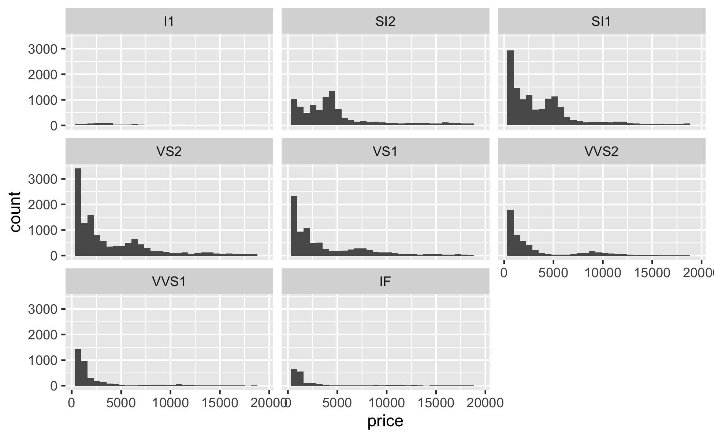
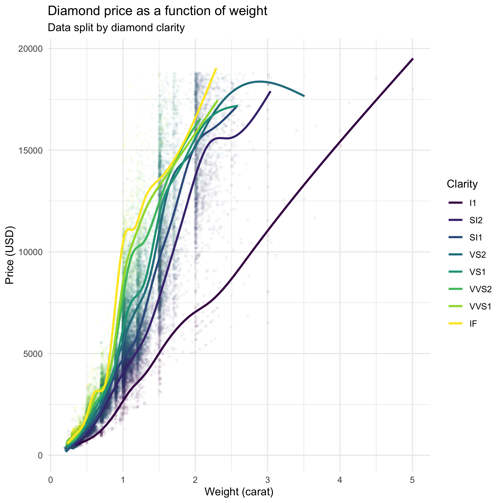

```{r setup, include=FALSE}
knitr::opts_chunk$set(echo = TRUE)
```

## 1. Introduction

This workshop is based on [Chapter 3 - Data visualisation](https://r4ds.had.co.nz/data-visualisation.html), from the free online book [R for Data Science](https://r4ds.had.co.nz/).

ggplot2 is a data visualisation package based on the "tidyverse" approach to coding in R. In the tidyverse:

* functions are designed around ["tidy" data](https://r4ds.had.co.nz/tidy-data.html),
* always use a data frame as their first argument,
* and are chained together with `%>%` (pipe operator)

This workshop is presented in the form of an R notebook. From the `.Rmd` file, individual code chunks can be run, or a full `.html` output can be generated by clicking on the **Knit** button.

For this workshop, we need to load the tidyverse collection of packages.

```{r}
library(tidyverse)
```

## 2. Plotting

### 2.1. `mpg` data set

`mpg` is a practice data frame included with the ggplot2 package. Descriptions for each variable are available by typing `?mpg` in the console, and we can view the structure of the data frame with the `glimpse()` command.

```{r}
glimpse(mpg)
```

### 2.2. Basics

```{r}
ggplot(data = mpg) +
  geom_point(mapping = aes(x = displ, y = hwy))
```

Each plot begins with the `ggplot()` function, which creates a blank canvas for the contents of the plot. `ggplot()` takes a data frame as the `data` argument, from which the plot will be generated.

`geom_point()` is one of many `geom_***()` functions, and indicates which type of layer should be added to the blank canvas. When used in a 2D canvas, `geom_point()` produces a scatter plot. Other popular geoms are `geom_line()`, `geom_bar()`, `geom_histogram()`, `geom_boxplot()`, or `geom_density()`. Options are listed in the [ggplot2 reference](https://ggplot2.tidyverse.org/reference/#section-geoms). Associated packages which extend the functionality of ggplot2 are listed in the [ggplot2 gallery](https://exts.ggplot2.tidyverse.org/gallery/).

The `mapping` argument defines which variables from the data frame should be mapped to the layer. It is always followed by the `aes()` function, in which mappings are defined.

Mappings can also be defined in the top-level `ggplot()` function rather than individually for each layer, in which case they carry over to each subsequent layer. Since the arguments `data`, `mapping`, `x`, and `y` are expected in most plots, they are generally not explicitly stated. A popular way to generate plots therefore makes use of the following syntax, which produces an identical plot to the one above (see [ggplot2 style guide](https://style.tidyverse.org/ggplot2.html)). This provides the opportunity to perform multiple operations on a data frame first, before piping it to the `ggplot()` function without needing to assign it first.

```{r}
mpg %>%
  ggplot(aes(displ, hwy)) +
  geom_point()
```

### 2.3. Aesthetics

The `x` and `y` arguments are called **aesthetics**. There are many more available aesthetics, to indicate that additional variables should be taken into consideration. Popular aesthetics include `colour`, `fill`, `alpha`, `shape`, or `size`, and a full list is available with the `ggplot2:::.all_aesthetics` command. If additional aesthetics are specified, a legend is automatically created.

```{r}
mpg %>% 
  ggplot(aes(displ, hwy, colour = class)) +
  geom_point()
```

Aesthetics can also be set manually, if specified outside of the `aes()` function. This is useful for fine-grained customisation of more complex plots.

```{r}
mpg %>% 
  ggplot(aes(displ, hwy)) +
  geom_point(colour = "blue")
```

### 2.4. Layers

Layers can be stacked to represent different visual properties of the data. For instance, `geom_smooth()` adds a smoothed line to your plot. As always, you can use `?geom_smooth` to get more information about the arguments of each function. Here, for instance, we can use different smoothing methods, by passing `lm`, `glm`, `loess`, or other values to the `method` argument.

```{r}
mpg %>% 
  ggplot(aes(displ, hwy)) +
  geom_point() +
  geom_smooth(method = "lm")
```

Aesthetics can be distributed as needed across the `ggplot()` function and the following geoms.

```{r}
mpg %>%
  ggplot(aes(cty, hwy)) +
  geom_point(aes(colour = class)) +
  geom_smooth(colour = "red")
```

### 2.5. Layout

Sometimes, for plots involving categorical data, it makes sense swap the x and y axes, to display horizontal columns or boxplots, or to provide more space for the labels on the x axis.

```{r}
# Before
mpg %>% 
  ggplot(aes(class, hwy)) +
  geom_boxplot()
```

```{r}
# After
mpg %>% 
  ggplot(aes(class, hwy)) +
  geom_boxplot() +
  coord_flip()
```

Plots can also be split into subplots according to values for one category, with `facet_wrap()`, or for two categories, with `facet_grid()`.

```{r}
mpg %>% 
  ggplot(aes(displ, hwy)) +
  geom_point() +
  facet_wrap(~ class)
```

```{r}
mpg %>% 
  ggplot(aes(displ, hwy)) +
  geom_point() +
  facet_grid(drv ~ cyl)
```

### 2.6. Customisation

Virtually everything can be customised on plots produced with ggplot2. A number of themes are available (see [ggplot2 reference](https://ggplot2.tidyverse.org/reference/#section-themes)), and many additional themes are available in associated packages (e.g., [`theme_apa()`](https://rdrr.io/cran/jtools/man/theme_apa.html) in the `jtools` package).

```{r}
mpg %>%
  ggplot(aes(displ, hwy, colour = class)) +
  geom_point() +
  theme_minimal()
```

Similarly, some colour palettes are included with ggpplot2, and many others are available in associated packages (see [`paletteer`](https://github.com/EmilHvitfeldt/paletteer) package for a convenient way to access palettes from many different packages). Colourblind-friendly palettes, such as `viridis` (see [vignette](https://cran.r-project.org/web/packages/viridis/vignettes/intro-to-viridis.html)), should be used for publication in academic journals. For more information on how to specify colour palettes, see [ggplot2 reference](https://ggplot2.tidyverse.org/reference/#section-scales).

```{r}
mpg %>%
  ggplot(aes(displ, hwy, colour = class)) +
  geom_point() +
  theme_minimal() +
  scale_colour_viridis_d()
```

There are many ways to specify titles, depending on what is needed exactly. A convenient way is to use the `labs()` function.

```{r}
mpg %>%
  ggplot(aes(displ, hwy, colour = class)) +
  geom_point() +
  theme_minimal() +
  scale_colour_viridis_d() +
  labs(
    title = "Fuel economy as a function of engine size",
    x = "Engine displacement (L.)",
    y = "Fuel efficiency on the highway (mpg.)",
    colour = "Car type"
  )
```

### 2.7. Saving plots

Do not use the built-in RStudio menu to save plots, as it will lower the resolution. Instead, use the `ggsave()` function, which saves the last plot generated by ggplot2. Read `?ggsave` to tailor your plots to the specification of a specific journal.

```{r}
mpg %>%
  ggplot(aes(displ, hwy)) +
  geom_point()
  
ggsave("output/plot.png")
```

## 3. Exercises

### 3.1. `diamonds` data set

For the exercises, we'll use another data frame included with ggplot2.

```{r}
glimpse(diamonds)
```

### 3.2. Fill in the blanks

Fill in the blanks to reproduce the plot below:

```{r, echo = FALSE}

```

To check your results, run the code chunk below. Alternatively, to produce the plot in the `.html` output, remove the `eval = FALSE` argument from the code chunk.

```{r, eval = FALSE}
# Fill in the blanks
*** %>% 
  ***(***(***)) +
  ***() +
  ***(~ ***)
```

### 3.3. Plot from scratch

Create the plot below from scratch:

```{r, echo = FALSE}

```

```{r}
# Create the plot here
```

## 4. Resources

* [ggplot2 reference](https://ggplot2.tidyverse.org/reference/index.html)
* [ggplot2 cheatsheet](https://github.com/rstudio/cheatsheets/blob/master/data-visualization-2.1.pdf)
* [ggplot2 book](https://ggplot2-book.org/)
* [R for Data Science book](https://r4ds.had.co.nz/)
* And most importantly, Google and Stack Overflow!